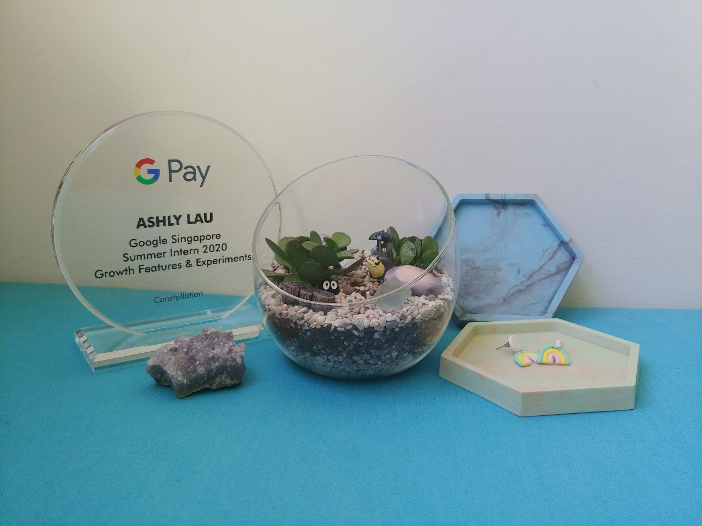
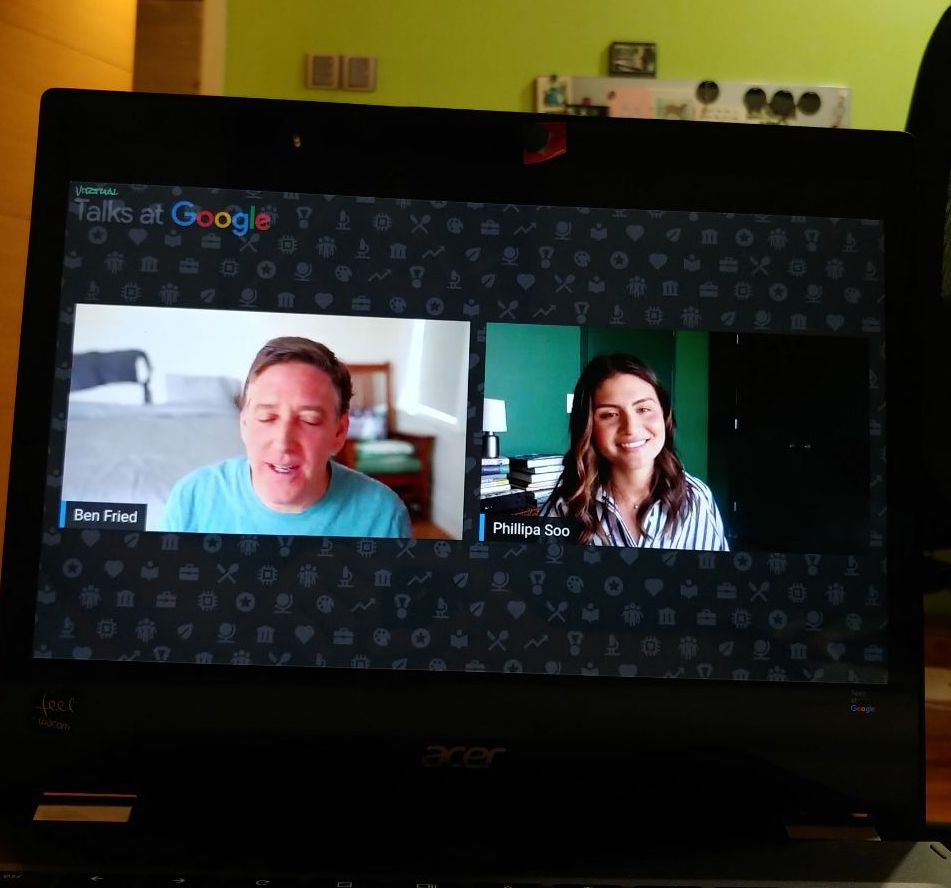

This internship was pretty different from the last, I might say. Initially, I had been matched to a project in the Mountain View headquarters, under the Android Play team. With my flight tickets and accomodations booked, the whirlwind that was March 2020 ultimately landed me in the Singapore office, under the [Google Pay](https://pay.google.com/intl/en_us/about/) team!

One stand out project I worked on was the server implementation of a new onboarding feature in the Google Pay app. This fully rolled out feature saves **9 seconds** off onboarding time! The work involved writing a new RPC and refactoring the existing one to fit into the new onboarding flow, as well as working with various different stakeholders -- another intern Sergio who worked on the client side implementation, UX designers, QA testers, and with teams from other offices to discuss API usages.

Despite our internship being fully remote, I still felt extremely connected and part of the team. The Google Pay team organised many team bonding activities - we had terrarium and coaster making workshops which were lots of fun :) I was also part of an 'Intern Task Force', where we organised many weekly bonding activities including a virtual amazing race. I also helped coordinate creating an intern batch t-shirt!

Major thanks to Nuwan, Chun Mun, Sergio, Marisa, Supriya and everyone who helped make this internship such a great learning experience!

Sweet perks :)

Live chat with Phillipa Soo! Check out the [podcast](https://open.spotify.com/episode/26IKIcq519NBowMuTh8VQW?si=XFBhHMB4TMOmDq7cKtcidg) on Spotify where she also answered my question on Imposter Syndrome.
