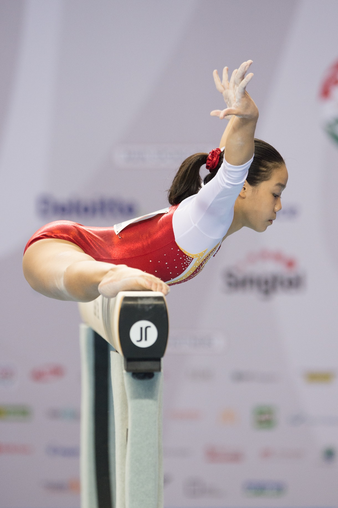
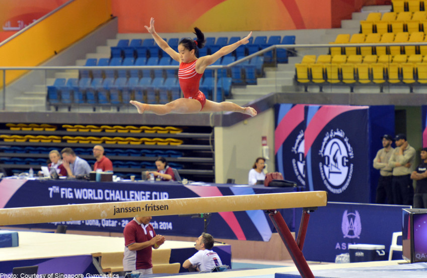
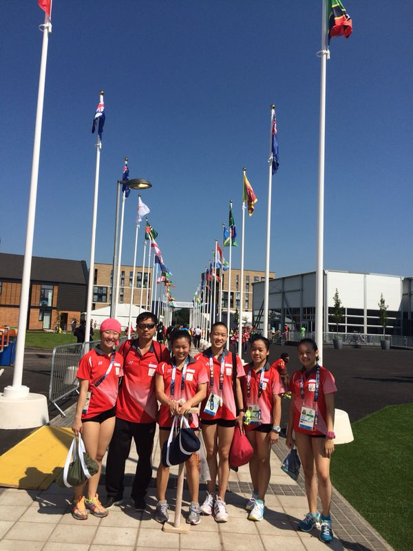
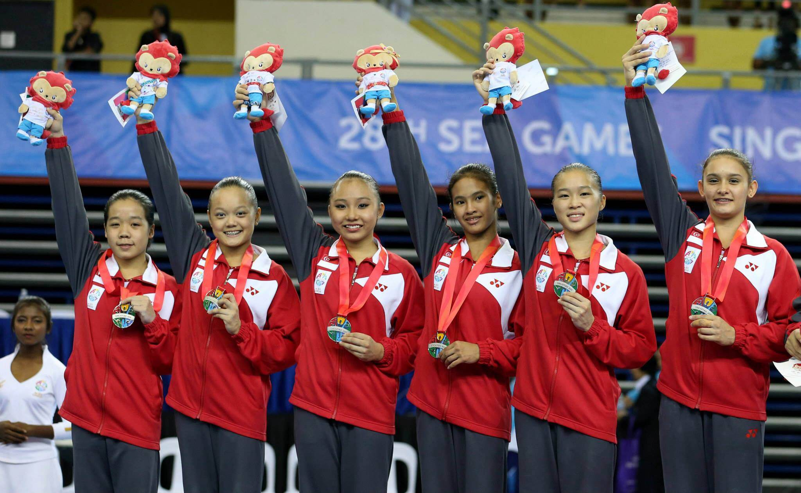
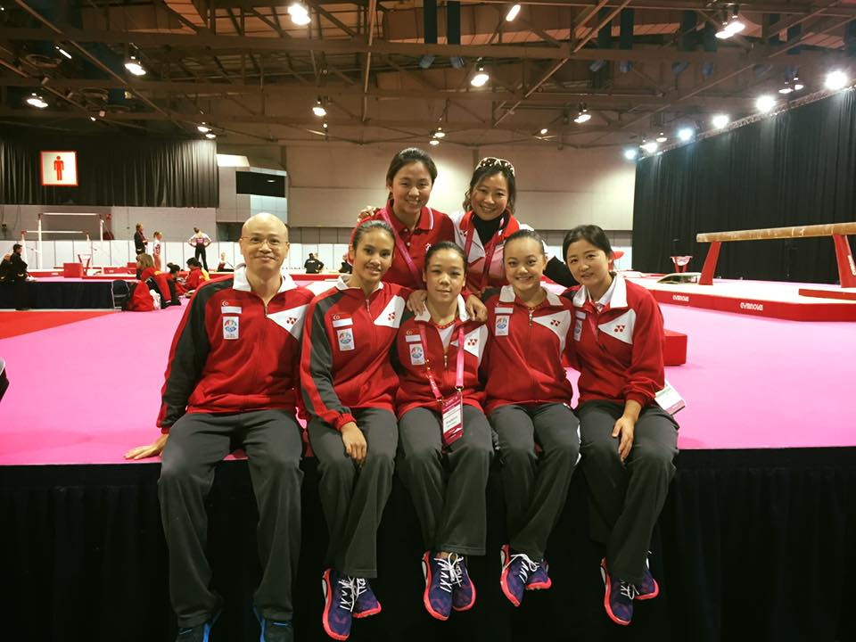

Throughout my gymnastics career, I was privileged to have many opportunities to represent Singapore. Here are some competitions I took part in:

- 2014, Doha: 7th FIG Gymnastics World Challenge Cup
- 2014, Glasgow: Commonwealth Games
- 2015, Singapore: 28th Southeast Asian Games
- 2015, Glasgow: World Artistic Gymnastics Championships

---

[**Doha World Challenge Cup 2014**](https://thegymter.net/2014/03/28/2014-doha-challenge-cup/)

This was my first international competition as a senior gymnast. To my surprise I managed to get a personal best score on the balance beam, as well as qualify for finals in both the uneven bars and balance beam.

Uneven Bars Final - 7th | Balance Beam Final - 7th

Articles: [AsiaOne](https://www.asiaone.com/ashly-posts-solid-score), [Straits Times](https://www.straitstimes.com/sport/gymnast-ashly-lau-finishes-seventh-in-doha-world-challenge-cup-balance-beam-event)

---

[**Commonwealth Games, Glasgow 2014**](https://en.wikipedia.org/wiki/Singapore_at_the_2014_Commonwealth_Games#Gymnastics)

We placed 6th out of 21 teams including England, Canada and Australia. It was an eye-opening experience staying in the Athletes Village, and watching other sports live.

Unfortunately I sustained a serious knee injury during the my performance on the floor exercise, which resulted in a long rehabilitation period after the competition.

Team Final - 6th

---

[**Southeast Asian Games, Singapore 2015**](https://en.wikipedia.org/wiki/Gymnastics_at_the_2015_Southeast_Asian_Games)

This was my first competition after my knee injury, and I was happy that I could help my team to a silver placing, as well as qualify to finals in the two events I competed in.

Team - Silver | Uneven Bars Final - 4th | Balance Beam Final - 8th

---

[**Artistic Gymnastics World Championships 2015**](https://en.wikipedia.org/wiki/2015_World_Artistic_Gymnastics_Championships)

Am amazing experience to round off my gymnastics career, being able to compete with and watch world-class gymnasts (and sporting idols) such as Simone Biles and Aliya Mustafina.

---

**Other awards**

- Meritorious Sportsgirl Award 2016
- Sport Singapore Sports Excellence Award ([SPEX Scholarship](https://www.todayonline.com/sports/first-66-spexscholars-unveiled)) 2013 & 2014
- [EAGLES](https://beta.moe.gov.sg/fees-assistance-awards-scholarships/awards-scholarships/edusave-awards/) (Edusave Awards for Achievement, Good Leadership and Service) 2011-2014
- Cecily Hinchliffe Award for Academic and Sporting Excellence 2014