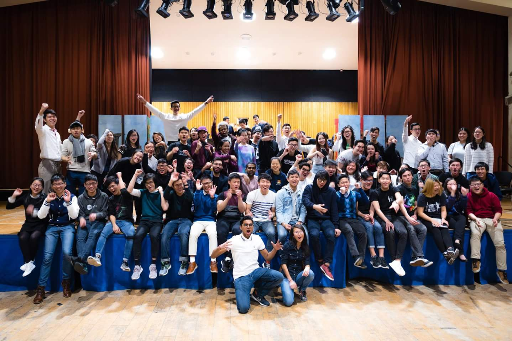
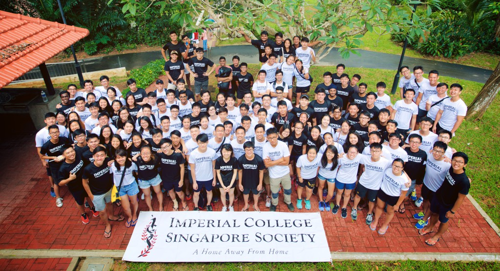
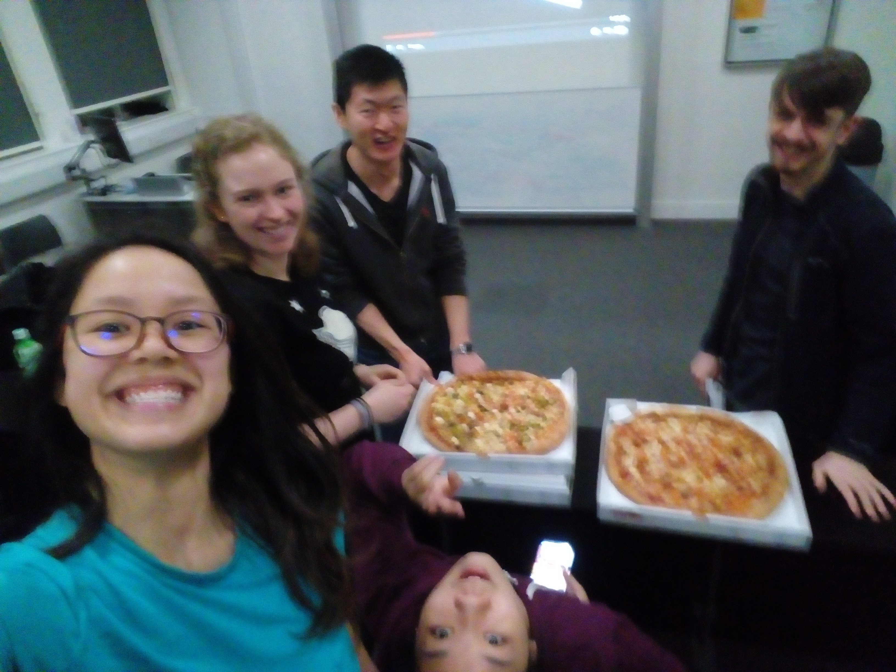
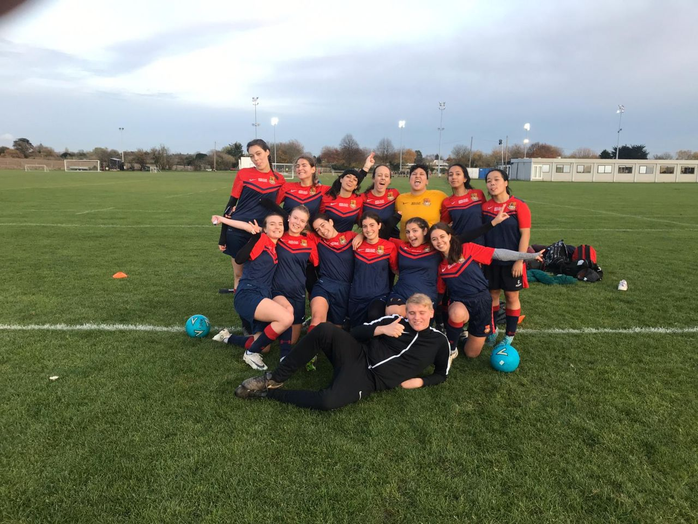

**First Year**

Modules: Programming (Haskell, Java, C), Databases, Hardware, Mathematical Methods, Graphs and Algorithms, Architecture, Logic, Discrete Structures, Reasoning about Programs, Entrepreneurship

Projects:
- **Topics Project** - Researched and created an informative website on a Simultaneous Localisation and Mapping using Depth Cameras, and presented our findings to an audience.
- **C Project** - Implemented an ARM emulator, assembler and assembly program in C.

---

**Second Year**

Modules: Programming (C++, Prolog), Operating Systems, Algorithms 2, Compilers, Networks, Software Engineering Design, Intro to Model-Based AI, Probability & Statistics, Models of Computation, Spanish

Projects:
- **PintOS** - Extended an operating system written in C with core features including priority scheduling, virtual memory and user programs.
- **WACC** - Designed and implemented a compiler with optimisations for the While language.
- [**cinect**](/projects/cinect) - Designed a group movie selection mobile application with a focus on human-centered-design principles.

---

**Third Year** 

Modules: Performance Engineering, Robotics, Type Systems for Programming Languages, Computer Vision, Intro to ML, Networks and Web Security, Business Economics

Projects/Activities:
- [**Software Engineering Group Project**](/projects/charje) - Crowd-sourcing agent-based machine learning algorithms using prediction marketplaces implemented on a blockchain.
- [**Undergraduate Teaching Assistant**](/imperial-ta) - Held weekly small group tutorials for first year students learning Haskell and Java.

---

**Fourth Year** 

Modules: Computational Finance, Deep Learning, Mathematics for Machine Learning, Natural Language Processing, Privacy Engineering, Project Management, Reinforcement Learning

Projects/Activities:
- [**Computing Industrial Placement**](/google-swe) - 5 month industrial placement at Google Singapore, working in the Google Pay team.
- [**MEng Computing Individual Project**](/privacy-ml) - Statistical Privacy Guarantees of Machine Learning Preprocessing Techniques (Accepted at [**TPDP 2021**](https://tpdp.journalprivacyconfidentiality.org/2021/)).

---

**Extra-Curriculars**

[**Singapore Society**](https://www.union.ic.ac.uk/osc/singapore/) (Academic Rep for Computing and Mathematics 2018/2019)

Our annual musical production

Orientation Camp

[**Parkour Soc**](https://www.imperialcollegeunion.org/activities/a-to-z/parkour-free-running-and-gymnastics) (Events Officer 2018/2019)

Lots of jumping and climbing on walls around London :)

[**Women's Football**](https://www.imperialcollegeunion.org/activities/a-to-z/football-womens)

