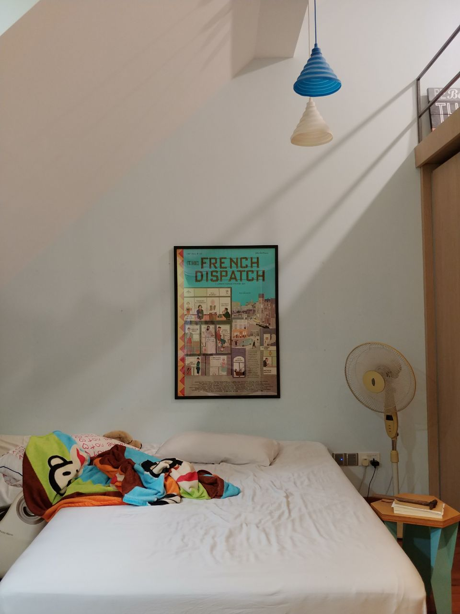

I don't really know what I'm gonna write here, but here's a list of my current favourite films for now:

**Movies**
- Portrait of a Lady on Fire (2019)
- Honey Boy (2019)
- West Side Story (1961)
- After Life (1998)
- Cabaret (1972)
- Princess Mononoke (1997)
- Sorry We Missed You (2019)

**TV**
- Killing Eve S3
- Westworld S3
- Fleabag S2

I've also been taking an MIT Open Cousrseware module [The Film Experience](https://ocw.mit.edu/courses/literature/21l-011-the-film-experience-fall-2013/) and it's been an absolute joy.

I like movie posters too.
