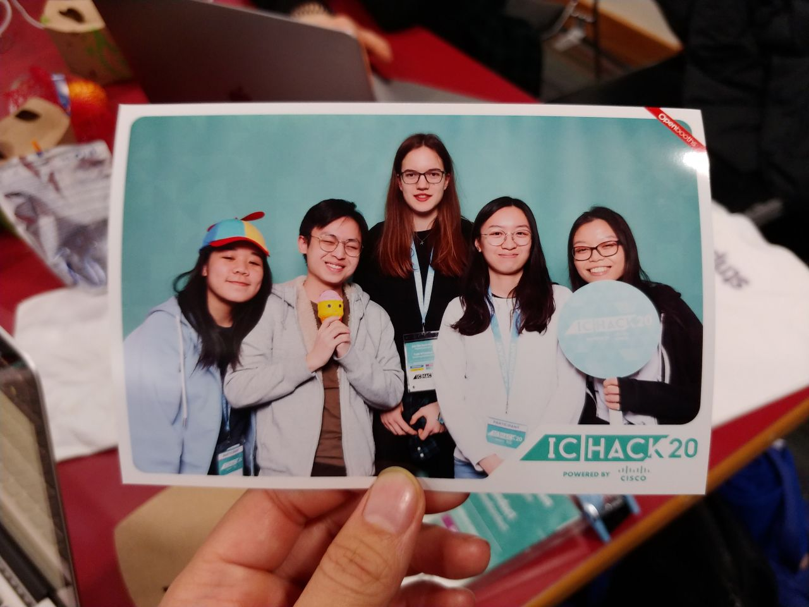

As part of IC Hack 2020, our team created a non-conventional video chat platform to bring people who are in separate places, even closer together.

Stitch Call uses real-time image segmentation to put video chat users together in the same screen and environment. We also integrated a few interactive games that make use of emotion detection, to make the hangout even more exciting.

`youtube: https://www.youtube.com/watch?v=wlyzsE8sHfA`

View our code on GitHub [here](https://github.com/jasminequah/ichack20-gsd).

Our team - gaussian with small std dev